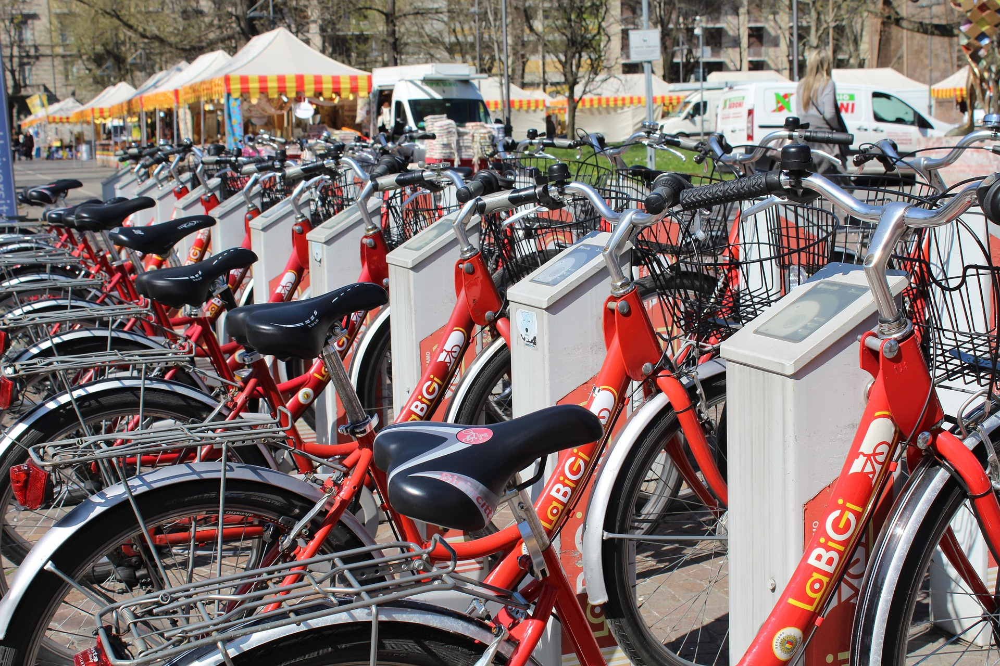

>**Note**: Please **fork** the current Udacity repository so that you will have a **remote** repository in **your** Github account. Clone the remote repository to your local machine. Later, as a part of the project "Post your Work on Github", you will push your proposed changes to the remote repository in your Github account.

## Date Created
February 10, 2022

## Project Title
### Explore US Bikeshare Data

## Description
The Explore US Bikeshare Data project allows users to explore Bikeshare Data in any one of three US cities: Chicago, Washington and New York City.
Users may discover:
 * The most frequent times of travel
 * The most popular stations and trip
 * Total and average travel times
 * Bikeshare user statistics including age and gender

## Files Used
- bikeshare.py
- chicago.csv
- washington.csv
- newyorkcity.csv

## Credits
Several websites were used as references for the bikeshare.py program including:
- Udacity mentor help database
- w3schools.com
- docs.python.org
- numpy.org
- pandas.pydata.org
- stackoverflow.com
- kite.com
- geeksforgeeks.org
